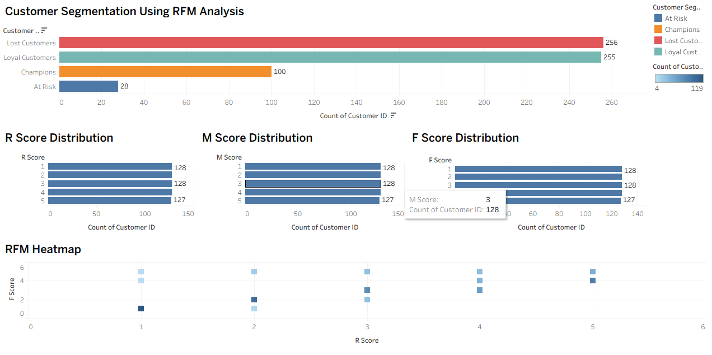

# 📊 RFM Customer Segmentation Analysis

## 📄 Description

This project performs Customer Segmentation using RFM (Recency, Frequency, Monetary) Analysis to identify valuable customer groups based on purchasing behavior. The analysis was carried out using SQL for data processing and Tableau for visualization, enabling actionable business insights through clear segmentation

---

## 🧠 Objective

To segment customers into meaningful groups such as Champions, Loyal Customers, At Risk, and Lost Customers by analyzing:
- **Recency** – How recently a customer made a purchase
- **Frequency** – How often a customer makes purchases
- **Monetary Value** – How much revenue a customer generates

---

## 📁 Dataset
The dataset contains transactional retail data with the following key fields:

- **CustomerID** – Unique customer identifier  
- **InvoiceDate** – Date and time of purchase  
- **InvoiceNo** – Unique invoice number  
- **Quantity** – Number of items purchased  
- **UnitPrice** – Price per unit  

Data was cleaned to remove missing customer IDs, negative quantities, and invalid prices.

---

## ⚙️ Tools & Technologies
- **SQL (MySQL)** – Data cleaning, transformation, and RFM modeling  
- **Tableau** – Data visualization and dashboard creation  

---

## 📊 Project Overview

In this project, I performed a complete **RFM (Recency, Frequency, Monetary) analysis** to understand customer purchasing behavior and segment customers based on their value.

The workflow involved:

1. **Data Cleaning & Preparation**  
   - Removed invalid and missing records  
   - Standardized date formats  
   - Filtered out negative quantities and prices  

2. **RFM Feature Engineering**  
   - Calculated **Recency** (days since last purchase)  
   - Calculated **Frequency** (number of transactions per customer)  
   - Calculated **Monetary Value** (total spend per customer)  

3. **RFM Scoring & Segmentation**  
   - Assigned R, F, and M scores using quantile-based ranking  
   - Combined scores to classify customers into meaningful segments such as:
     - Champions  
     - Loyal Customers  
     - Potential Loyalists  
     - At Risk  
     - Lost Customers  

4. **Visualization & Analysis**
   - Built visualizations using the cleaned RFM table  
   - Analyzed customer distribution, value contribution, and behavioral patterns  
   - Created dashboards to support business insights and decision-making  

This approach ensures a clean analytical pipeline—from raw data to actionable customer insights.

---

## 📊 Visualizations

- Customer Segmentation Distribution
- R, F, M Score Distributions
- RFM Heatmap



These visualizations help identify:
- High-value customers (Champions)
- Retention opportunities (Loyal Customers)
- Churn risk (At Risk & Lost Customers)

---

## 🔎 Key Insights
- A small group of customers contributes a large portion of revenue  
- Loyal and Champion segments represent the most valuable customers  
- At-Risk and Lost customers highlight opportunities for re-engagement  
- RFM segmentation provides clear, actionable business insights  

---

## 💼 Business Value

This project enables organizations to better understand customer behavior and improve decision-making through data-driven insights. By applying RFM segmentation, businesses can:
- Identify high-value and loyal customers for targeted retention strategies
- Detect at-risk customers early and reduce churn
- Optimize marketing spend by focusing on high-return customer segments
- Improve personalization and customer lifetime value (CLV)
Overall, this analysis supports smarter marketing, improved customer engagement, and increased profitability.

---

## ✅ Conclusion

This project demonstrates how SQL-driven analytics and visual storytelling using Tableau can transform raw transactional data into actionable business insights. By applying RFM analysis, customers are segmented into meaningful groups that support strategic decision-making, customer retention, and revenue growth.
The approach is scalable and can be easily adapted to different datasets or industries.

---

## 👤 Author
**Muhammed Nafih**  
Data Analyst | SQL | Tableau | Data Visualization

🔗 **LinkedIn:**  
https://www.linkedin.com/in/nafihhmohd/

---

## ▶️ How to Run
1. Clone the repository  
   ```bash
   git clone https://github.com/nafihhmohd/rfm-segmentation-sql.git


